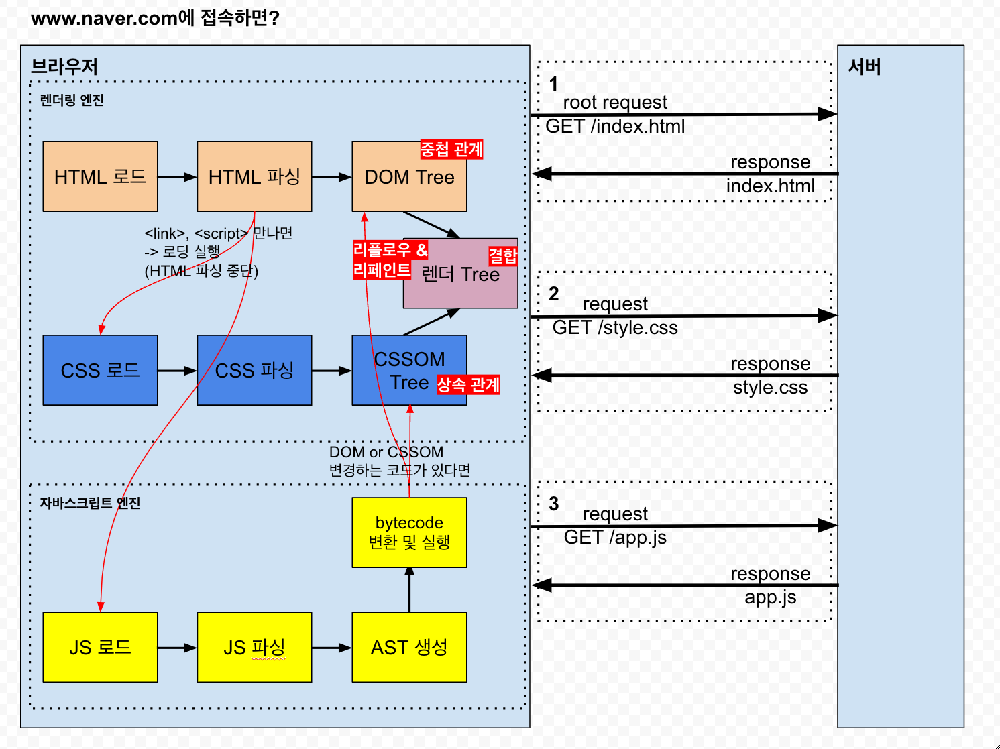

# useLayoutEffect

> 리페인팅 전에 실행되는 useEffect, 성능 저하 리스크가 있으므로 제한적으로 사용해야 함

## useEffect와의 비교

- 기본적으로 `useEffect` 와 동일 (setup 함수, cleanup 함수, 의존성 배열 등)

<table>
    <thead>
        <tr>
            <th>특징</th>
            <th>useEffect</th>
            <th>useLayoutEffect</th>
        </tr>
    </thead>
    <tbody>
        <tr>
            <td>실행 시점</td>
            <td>컴포넌트 렌더링이 화면에 반영된 후 비동기적으로 실행</td>
            <td>컴포넌트 렌더링이 화면에 반영되기 바로 직전, 동기적으로 실행</td>
        </tr>
        <tr>
            <td>사용 사례</td>
            <td>데이터 fetching, 이벤트 리스너 등록, 다른 비동기 작업</td>
            <td>DOM 노드를 직접 조작하거나, 레이아웃을 조정해야 할 때</td>
        </tr>
        <tr>
            <td>주의사항</td>
            <td>화면 깜빡임을 일으킬 수 있는 작업을 피해야 함</td>
            <td>브라우저가 화면을 그리기 전에 실행되므로 성능에 영향을 줄 수 있음</td>
        </tr>
    </tbody>
</table>

## 리렌더링, 리플로우, 리페인팅

React 리렌더링

1. 컴포넌트가 상태, props 변경 감지
2. 새로운 가상 DOM 생성
3. 이전 가상 DOM과 새로운 가상 DOM을 비교하여 변경에 필요한 최소한의 차이 계산
4. 계산된 차이만큼만 실제 DOM에 적용 (렌더 트리 업데이트)
5. (선택적) useLayoutEffect 동작 ->

-> 브라우저 렌더링 (DOM 트리 및 CSSOM 트리 업데이트 내용이 결합되어 렌더 트리가 업데이트 되어 있음)

1. 리플로우: 레이아웃 재계산 (element의 위치와 크기 조정)
2. 리페인팅: 리플로우 이후 스타일 재적용 (레이아웃 변화는 없음)

## SSR 에서의 한계

> SSR에서 useLayoutEffect 사용시 에러 메시지: `useLayoutEffect` does nothing on the server

- useEffect 와 useLayoutEffect 는 기본적으로 브라우저 환경에서 실행되도록 설계됨
- useLayoutEffect의 목적은 최신 레이아웃 데이터를 사용해서 컴포넌트를 렌더링하는 것이다. 그런데 서버에서는 DOM 변경을 추적할 수 없으므로 아예 사용이 불가능하다
  - useEffect의 경우 CSR 방식으로 전환되어 사용이 가능

### 해결방법

- useLayoutEffect 대신 useEffect 사용 (리페인팅 막지 않아서 레이아웃 재계산 가능)
  - 추가로, Suspense 활용하여 fallback 대신 보여주기 (`use client` 명시)
- `useSyncExternalStore` 활용 (SSR 가능)
  - 컴포넌트를 외부 데이터 저장소와 동기화하고, 레이아웃 계산 외에 다른 이유일 때
